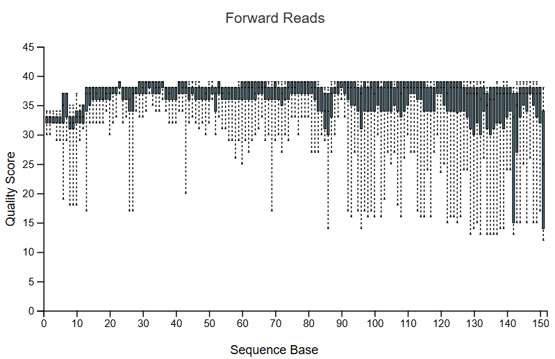
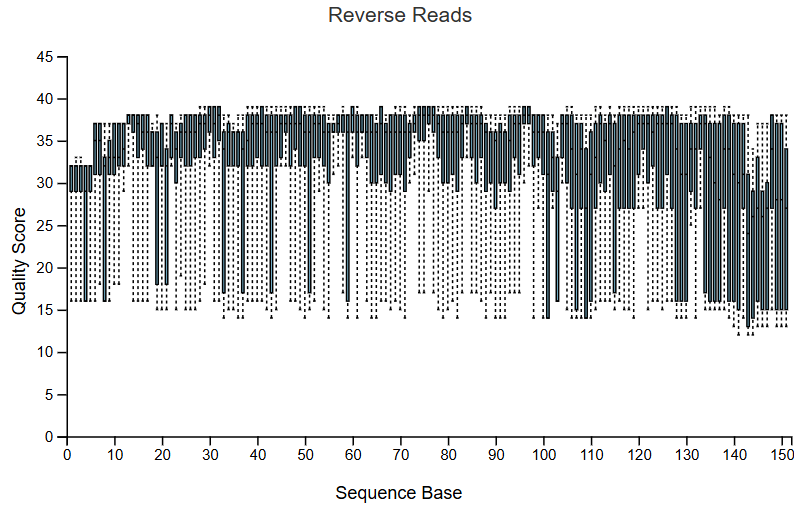
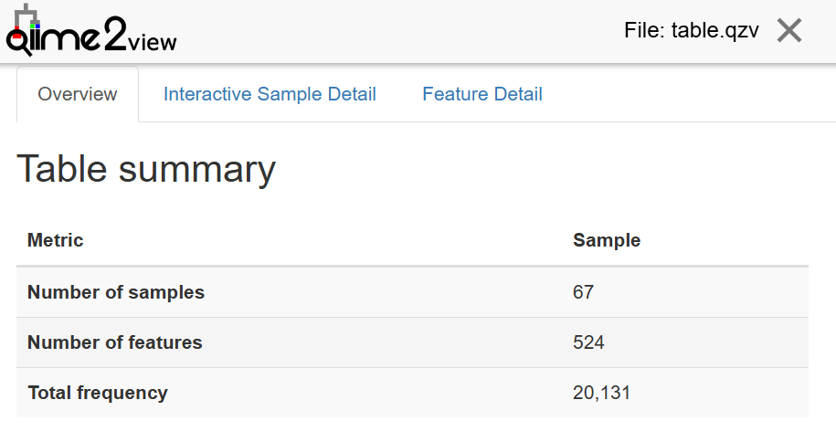
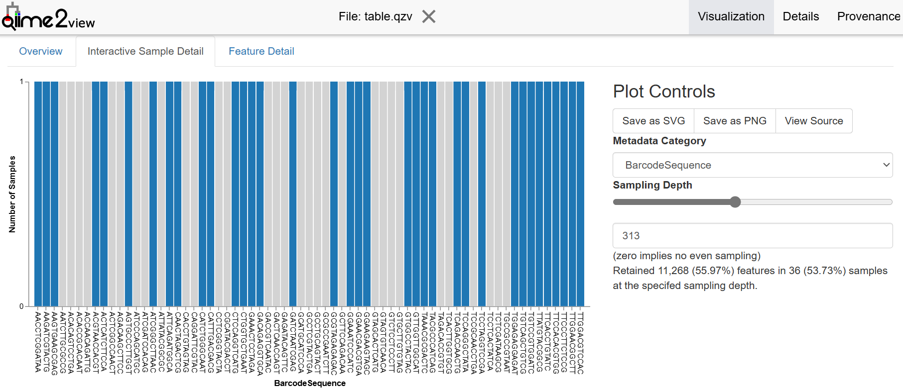
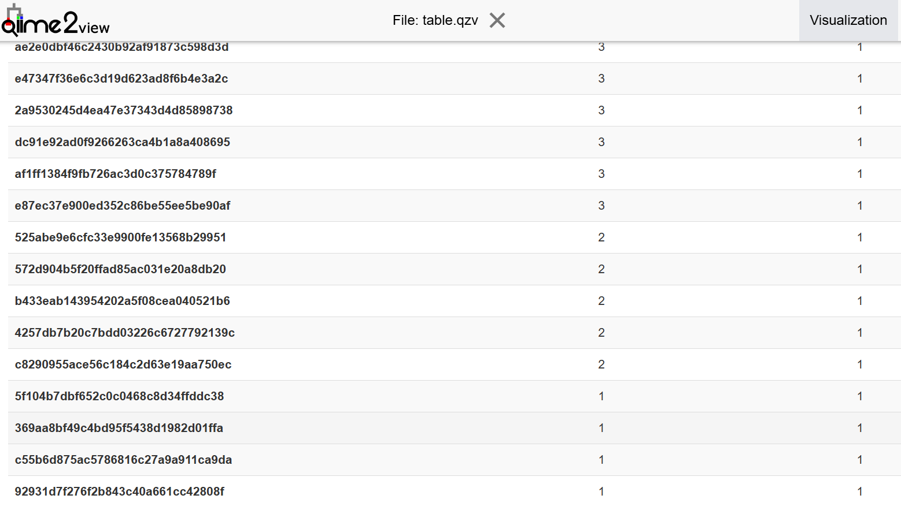
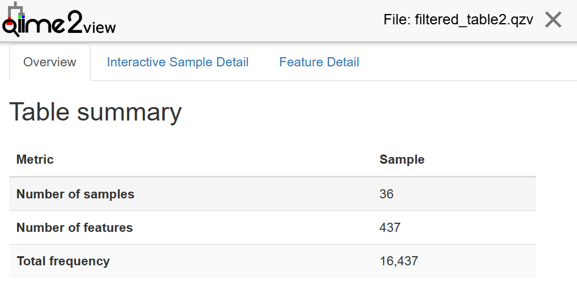
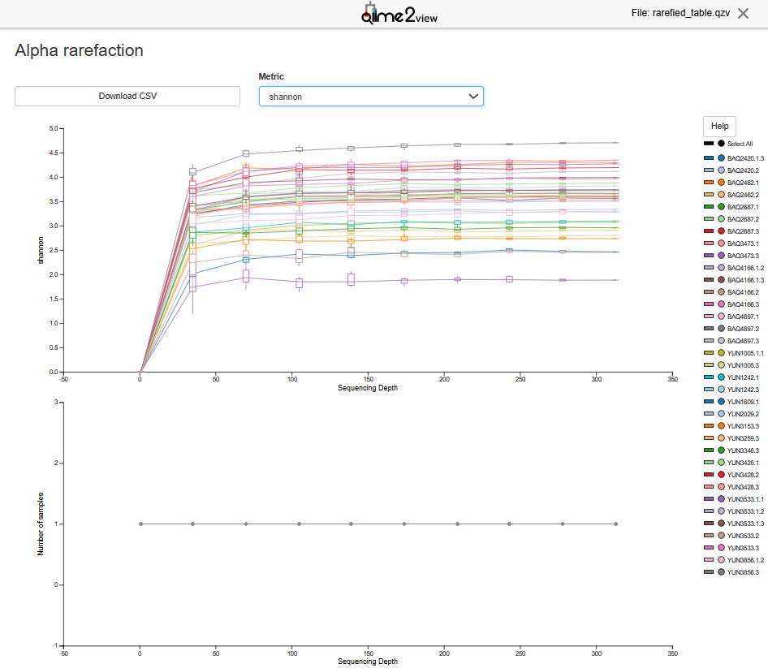
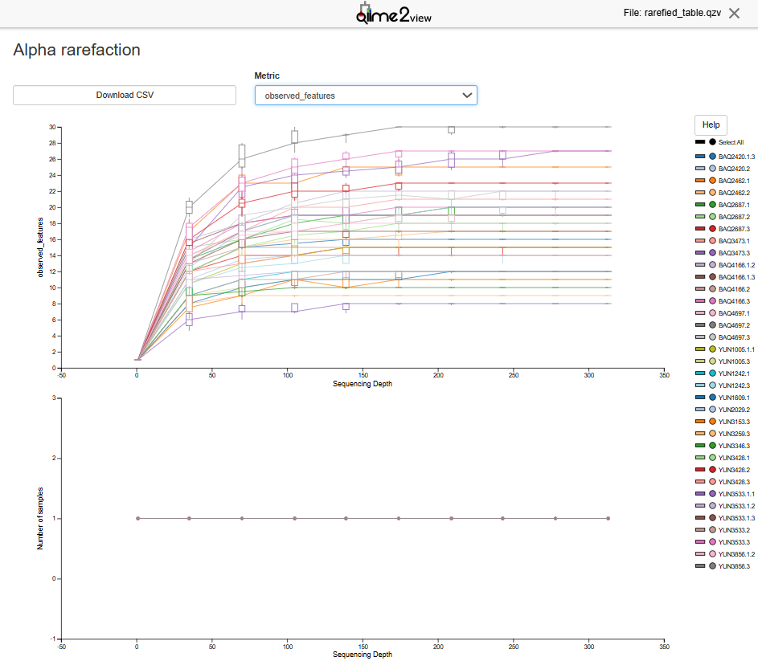
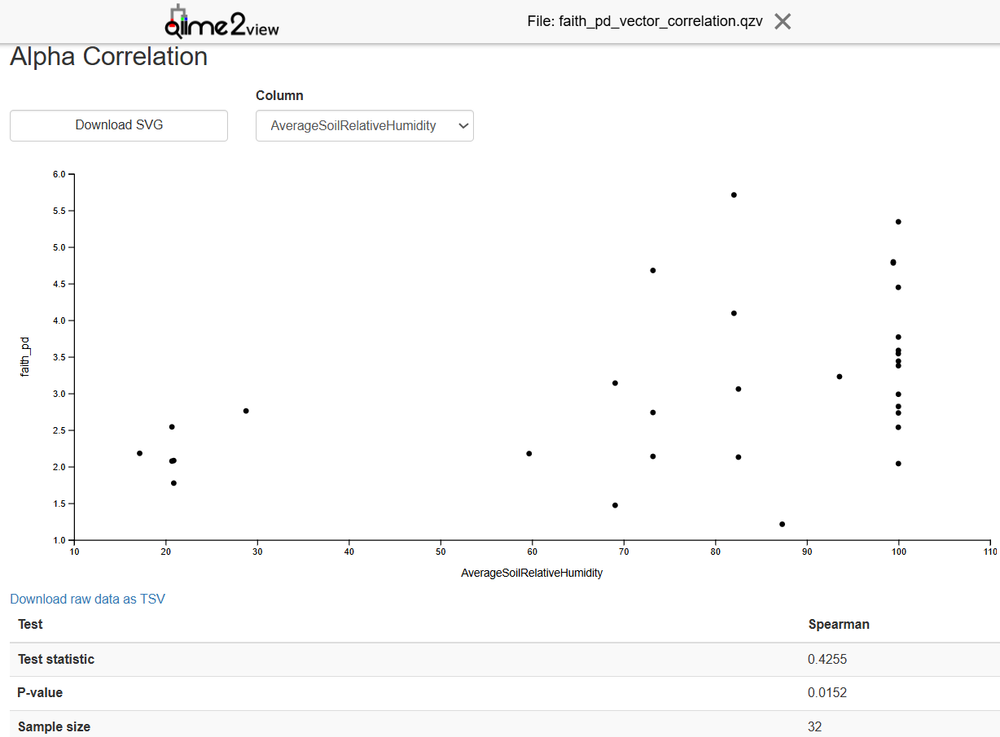
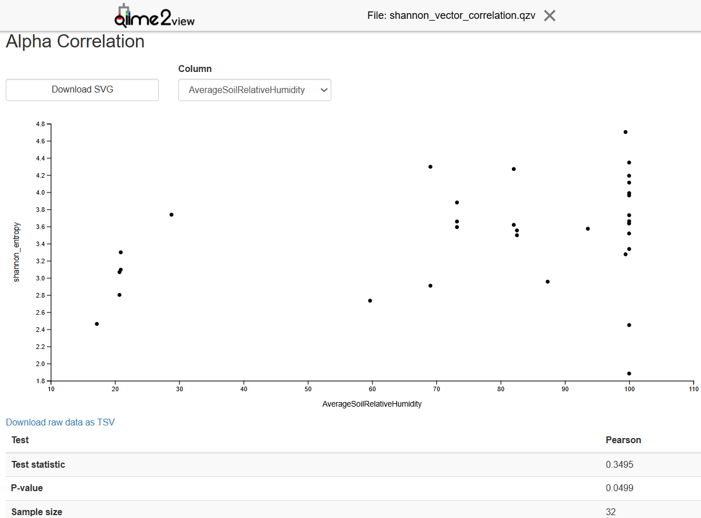

```{bash, eval=FALSE, engine="sh"}
cd ActividadAmplicones/

tar -xvf Ejercicio_suelos.tar.gz

conda activate qiime2-amplicon-2023.9

qiime tools import \
> --type EMPPairedEndSequences \
> --input-path raw_data \
> --output-path raw_data.qza
Imported raw_data/ as EMPPairedEndDirFmt to r raw_data.qza
```

Once the data have been imported into QIIME2, I proceed to answer the questions:

**After importing the data, describe and justify the tools (and their parameters) you would use to filter by quality. you would use to filter by quality.**

As I am going to work with 10% of the readings from the original files, I need to sub-sample. sub-sampling and for this it is first necessary to demultiplex the raw sequences in order to assign each read to its sample. assign each read to its corresponding sample.

Demultiplexing is performed as follows:

```{bash, eval=FALSE, engine="sh"}
qiime demux emp-paired \  # indicates that the data are from paired sequences
> --m-barcodes-file sample-metadata.tsv \  # specifies the metadata file containing the barcodes
> --m-barcodes-column BarcodeSequence \  # specifies the column in the metadata file that contains the sequences
> --p-rev-comp-mapping-barcodes \  # indicates that the barcode sequences in the mapping file must be inverted and complemented to match the orientation of the raw data
> --i-seqs raw_data.qza \  # specifies the archiving of unprocessed data
> --o-per-sample-sequences demux.qza \  # specifies the output file that will contain the demultiplexed sequences of each sample
> --o-error-correction-details demux-details.qza # specifies the output file that will contain details of the error correction during the process
Saved SampleData[PairedEndSequencesWithQuality] to: demux.qza
Saved ErrorCorrectionDetails to: demux-details.qza
```

I then carry out sub-sampling:

```{bash, eval=FALSE, engine="sh"}
qiime demux subsample-paired \  # to perform sub-sampling of paired sequences
> --i-sequences demux.qza \  # specifies the file containing the demultiplexed sequences
> --p-fraction 0.1 \  # causes 10 % of the sequences to be retained during sub-sampling
> --o-subsampled-sequences demux-subsample.qza
Saved SampleData[PairedEndSequencesWithQuality] to: demux-subsample.qza
```

As the primers have only been used to amplify the sequences and may contribute to sequencing errors, they must be removed:

```{bash, eval=FALSE, engine="sh"}
qiime cutadapt trim-paired \  # the cutadapt tool is used for this purpose
> --i-demultiplexed-sequences demux-subsample.qza \
> --p-cores 4 \  # number of processors used for trimming
> --p-front-f GTGYCAGCMGCCGCGGTAAGTGYCAGCMGCCGCGGTAA \  # forward primer sequence
> --p-front-r GGACTACNVGGGTWTCTAAT \  # reverse primer sequence
> --o-trimmed-sequences demux-subsample-trimmed.qza \
> --verbose # provides additional information during the execution of the command
Saved SampleData[PairedEndSequencesWithQuality] to: demux-subsample-trimmed.qza
```

In order to convert the resulting file of sequences without the primers to a .qzv format in which the descriptive statistics of the sequences without primers can be visualised, I do the following:

```{bash, eval=FALSE, engine="sh"}
qiime demux summarize \
> --i-data demux-subsample-trimmed.qza \
> --o-visualization demux-subsample-trimmed.qzv
Saved Visualization to: demux-subsample-trimmed.qzv
```




Finally, for quality filtering, denoising is performed to identify and correct errors introduced during sequencing and amplification of the sequences.

When observing the quality graph of the demux-subsample-trimmed.qzv file, it can be seen that at the beginning and end of both sequences (forward and reverse), there is a lower quality of the reads, so both sequences are trimmed at nucleotide 13 and 141. This decrease in the initial quality is due to the fact that these are the sequences of the first cycle and the last ones have been sequenced in the last cycles.

```{bash, eval=FALSE, engine="sh"}
qiime dada2 denoise-paired \  # the tool dada2 is used
> --i-demultiplexed-seqs demux-subsample-trimmed.qza \
> --p-trim-left-f 13 \  # number of bases to be removed from the 5' end of the forward sequence
> --p-trim-left-r 10 \  # number of bases to be removed from the 5' end of the reverse sequence
> --p-trunc-len-f 147 \  # truncation of sequences paired to 147 forward
> --p-trunc-len-r 135 \  # truncation of sequences paired to 135 in reverse
> --p-n-threads 4 \  # number of processors used
> --o-table table.qza \
> --o-representative-sequences rep_seqs.qza \
> --o-denoising-stats denoising_stats.qza
Saved FeatureTable[Frequency] to: table.qza
Saved FeatureData[Sequence] to: rep_seqs.qza
Saved SampleData[DADA2Stats] to: denoising_stats.qza
```


The following commands are used to display the 3 generated files:

```{bash, eval=FALSE, engine="sh"}
qiime metadata tabulate \
> --m-input-file denoising_stats.qza \
> --o-visualization denoising_stats.qzv
Saved Visualization to: denoising_stats.qzv
qiime feature-table summarize \
> --i-table table.qza \
> --o-visualization table.qzv \
> --m-sample-metadata-file sample-metadata.tsv
Saved Visualization to: table.qzv
qiime feature-table tabulate-seqs \
> --i-data rep_seqs.qza \
> --o-visualization rep_seqs.qzv
Saved Visualization to: rep_seqs.qzv
```

As a result, 3 files are generated: 
- denoising_stats.qzv: contains a summary of the generated statistics
- table.qzv: contains the number of each ASV in each sample
- rep_seqs.qzv: contains the representative sequences

**Describe the result of clustering sequences in ASVs using the dada2 plug-in.  What percentage of sequences is retained after this process?**

To answer this and the next question, I view the denoising_stats.qzv file.

After doing the quality filtering there are 28.57-95.69 % of retained sequences, so it is not good quality data.

After overlapping the forward and reverse sequences there are 7.69-75.45 % of retained sequences.

After analysing the chimeras, I have recovered 7.69-73.83 % of non-chimeric sequences, this data is also not of high quality because retention of more than 30 % would be considered good quality.

**At which step is the largest number of sequences discarded?** 

The one that discards the highest number of sequences is the chimeric sequences.

**How many ASVs are detected in this study?** 

To answer this question, I view the table.qzv file.



In this study, 524 features or ASVs are detected.

**Does QIIME2 allow another algorithm to be used for the creation of ASVs?**

Yes, QIIME2 can use the deblur algorithm as you can see by running the following command:

```{bash, eval=FALSE, engine="sh"}
qiime --help

dada2 Plugin for sequence quality control with DADA2.
deblur Plugin for sequence quality control with Deblur.
```

**Why is it important to rarefaction or normalise the data before carrying out diversity calculations?**

To avoid falsifying the results because the numbers of reads in each sample may be different from sample to sample. Rarefaccing or normalising the samples will equalise the frequency of sequences in the samples so that comparisons can be made between samples and therefore diversity calculations can be carried out.

**What value would you choose for -p-sampling-depth in core-metrics-phylogenetics?**



I would choose a value of 313 as in table.qzv you can see that this value is the one with which I retain a higher number of features in the samples and therefore I will get a better rarefaction.

**Evaluate the relationship of the alpha diversity of the community with the relative humidity of the soil. Analyse at least two alpha diversity indices. Discuss the results and describe the method used to reach these conclusions. To explore the association between continuous metadata and diversity you may find the qiime diversity alpha-correlation command useful.**

First I filter the samples by sequencing depth and for this I look in the table.qzv file in the Interactive Sample Detail part. In my case, the sequencing depth is samples with a frequency of at least 313, so I am left with 36 samples.  I am left with 36 samples.

```{bash, eval=FALSE, engine="sh"}
qiime feature-table filter-samples \
> --i-table table.qza \
> --p-min-frequency 313 \
> --o-filtered-table filtered_table.qza
Saved FeatureTable[Frequency] to: filtered_table.qza
```

Next, I filter out the sequences that are not very abundant, such as singletons. To do this I look in the Feature Detail part of the table.qzv file. 



As it can be seen there are 4 ASVs with a frequency of 1 that have to be removed. This is done in the following way:

```{bash, eval=FALSE, engine="sh"}
qiime feature-table filter-features \
> --i-table filtered_table.qza \
> --p-min-frequency 2 \
> --o-filtered-table filtered_table2.qza
Saved FeatureTable[Frequency] to: filtered_table2.qza
```

To remove the filtered sequences from the reference sequence file I do the following:

```{bash, eval=FALSE, engine="sh"}
qiime feature-table filter-seqs \
> --i-data rep_seqs.qza \
> --i-table filtered_table2.qza \
> --o-filtered-data rep_seqs_filt.qza
Saved FeatureData[Sequence] to: rep_seqs_filt.qza
```

I proceed to build a phylogenetic tree:

1. Multiple alignment

```{bash, eval=FALSE, engine="sh"}
qiime alignment mafft \
> --i-sequences rep_seqs_filt.qza \
> --o-alignment rep_seqs_filt_aligned.qza
Saved FeatureData[AlignedSequence] to: rep_seqs_filt_aligned.qza
```

2. Filtering or masking of regions of low complexity

```{bash, eval=FALSE, engine="sh"}
qiime alignment mask \
> --i-alignment rep_seqs_filt_aligned.qza \
> --o-masked-alignment rep_seqs_filt_aligned_masked.qza
Saved FeatureData[AlignedSequence] to: rep_seqs_filt_aligned_masked.qza
```

3. FastTree

```{bash, eval=FALSE, engine="sh"}
qiime phylogeny fasttree \
> --i-alignment rep_seqs_filt_aligned_masked.qza \
> --o-tree rep_seqs_filt_aligned_masked_tree
Saved Phylogeny[Unrooted] to: rep_seqs_filt_aligned_masked_tree.qza
```

4. Rooting (mid-point)

```{bash, eval=FALSE, engine="sh"}
qiime phylogeny midpoint-root \
> --i-tree rep_seqs_filt_aligned_masked_tree.qza \
> --o-rooted-tree rep_seqs_filt_aligned_masked_tree_rooted.qza
Saved Phylogeny[Rooted] to: rep_seqs_filt_aligned_masked_tree_rooted.qza
```

To be able to display the filtered_table2.qza file generated earlier:

```{bash, eval=FALSE, engine="sh"}
qiime feature-table summarize \
> --i-table filtered_table2.qza \
> --o-visualization filtered_table2.qzv \
> --m-sample-metadata-file sample-metadata.tsv
Saved Visualization to: filtered_table2.qzv
```



I continue using the phylogenetic tree to take into account the evolutionary relationships between the sequences in order to perform the rarefaction of the samples.

```{bash, eval=FALSE, engine="sh"}
qiime diversity core-metrics-phylogenetic \
> --i-table filtered_table2.qza \
> --i-phylogeny rep_seqs_filt_aligned_masked_tree_rooted.qza \  # especifica el archivo que contiene el árbol filogenético de las secuencias representativas
> --p-sampling-depth 313 \
> --m-metadata-file sample-metadata.tsv \
> --output-dir diversity
```

Then, in order to evaluate the alpha diversity I generate rarefaction curves with the following command, in which I have used a maximum rarefaction depth of 313 since it corresponds to the sample with less sequences after rarefaction, in this way I manage to have a comparable number of samples.

```{bash, eval=FALSE, engine="sh"}
qiime diversity alpha-rarefaction \
> --i-table diversity/rarefied_table.qza \
> --p-max-depth 313 \
> --o-visualization diversity/rarefied_table.qzv
Saved Visualization to: diversity/rarefied_table.qzv
```





Looking at the rarefied_table.qzv file in qiime2 I can see that the samples are clearly representative, as it can be seen how as the sampling depth increases the shannon diversity curves stabilise suggesting that the diversity has been well captured. Furthermore, a stabilisation of the rarefaction curves can also be seen in the observed features, indicating that the real species richness has been reached and that the rarefaction has been carried out properly.

To calculate and evaluate the correlation of the alpha diversity of the community with the relative humidity of the soil, I run the following command in which I use the PD alpha diversity index generated earlier by applying the Spearman Correlation Test because it is a non-parametric method, and makes no assumptions about the distribution of the data.

```{bash, eval=FALSE, engine="sh"}
qiime diversity alpha-correlation \
> --i-alpha-diversity diversity/faith_pd_vector.qza \
> --m-metadata-file sample-metadata.tsv \
> --p-method spearman \
> --o-visualization faith_pd_vector_correlation.qzv
Saved Visualization to: faith_pd_vector_correlation.qzv
```



When viewing the file faith_pd_vector_correlation.qzv I can see a slight tendency for the dots to rise diagonally from the lower left corner to the upper right corner, this indicates that there is a positive correlation, i.e. as the relative humidity of the soil increases, so does the prokaryotic diversity of the soil.

However, there is a large dispersion of the points so this correlation is not very strong, this is probably due to the fact that there are other factors that influence diversity. 

The conclusions I have drawn from the graph are supported by the statistical data from the Spearman Correlation test performed which reinforces the evidence of a significant and positive correlation between prokaryotic diversity and soil moisture, as the test statistic has a positive value (0.4255), suggesting a positive correlation, and the p-value 0.0152 is less than 0.05, which denotes evidence to reject the null hypothesis of no correlation. 

To calculate and evaluate the correlation of community alpha diversity with soil relative humidity, I run the following command in which I use the Shannon alpha diversity index generated above by applying the Spearman Correlation Test because it is a non-parametric method and makes no assumptions about the distribution of the data.

```{bash, eval=FALSE, engine="sh"}
qiime diversity alpha-correlation \
> --i-alpha-diversity diversity/shannon_vector.qza \
> --m-metadata-file sample-metadata.tsv \
> --p-method pearson \
> --o-visualization shannon_vector_correlation.qzv
Saved Visualization to: shannon_vector_correlation.qzv
```



When viewing the .qzv file I observe a pattern very similar to that of the PD index described above in the graph, which Spearman's test values are not exactly the same (test statistic: 0.3495; p-value: 0.0499) but suggest the same conclusions.
